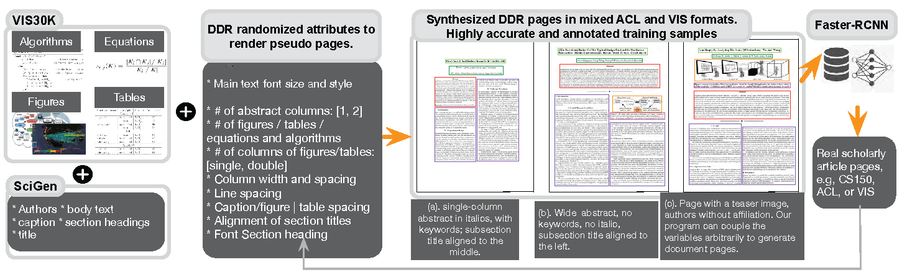

# Documentat Extraction
<p align="center">
  
</p>

This repo implements the document components extraction (<span style="color:gold">trained model</span> and <span style="color:gold">prediction</span>) for the following two papers:

(1) DeepPaperComposer: A Simple Solution for Training Data Preparation for Parsing Research Papers. [Paper](https://aclanthology.org/2020.sdp-1.10.pdf)  
(2) Document Domain Randomization for Deep Learning Document Layout Extraction. [Paper](https://arxiv.org/pdf/2105.14931.pdf)

When a research paper is only available in image format (e.g., png and jpg) or pdf format, our model will help you extract the graphical (figure, table, algorithm, equation) and textual (title, abstract, caption, body text, etc.) components from it. Specifically, the trained model will scan each page image and provide the bounding boxes for each of the paper components. With these bounding boxes, downstream tasks such as figure/table extraction and text OCR can be conducted. 

This type of AI-based end-to-end document layout extraction is widely used in online paper databases or research tools such as SemanticScholar. Our model is excellent at extracting compoments from 2-column research papers and can be trained to extract from other styles of publications. 

## Prerequisite
The document extraction model is based on the tensorflow implementation of the Faster-RCNN model by Tensorpack. [Link](https://github.com/tensorpack/tensorpack/tree/master)

1. Install the tensorpack package to your machine following the above link. Create an environment if needed (e.g., frcnn).
2. Check to make sure it is successfully installed - the package path will be saved to environment path, and you can run the BALLOON exmaple provided in ./examples/FasterRCNN/.
3. Clone this repo to a folder on your machine (need not to be under the tensorpack path).

## Trained Model
The trained model consisting of two files is contained in a zip file on google drive.
1. Download the zip file [here](https://drive.google.com/file/d/13i7JaHeQp5hCpyDAVHoGjA1pnhJWTQa_/view?usp=sharing)
2. Unzip them to the root path of the cloned repo where ddr_YOLO_output.py is located.

## Paper Images
Before running the model prediction, convert the paper to images (.png or .jpg) for each of its pages. Most likely the paper is in pdf format and example codes are provided in ./pdf_to_images. Image size better be >=800 pixels on the short edge. The model predicts by folder so place the page images of your interest in a folder. If you put papers of different issues or years into different folders, you can predict them in batches (see the section below).

## Extracting...
Usage example:
```
python ddr_YOLO_output.py --predict ./testing/CHI/2018/*.jpg \
  --load vis31yr_0.9_960000.data-00000-of-00001
```
Arrange multiple folders into a bash file for batch processing - see <span style="color:gold">ddr_predict_papers.sh</span> for example.

At prediction, two new folders will be created parallel to the image folder. For example,if the image folder is <span style="color:gold">CHI\2016</span>, then 
1. <span style="color:gold">CHI\2016_frcnn</span> will contain the predicted page images showing all the bounding boxes.
2. <span style="color:gold">CHI\2016_frcnn_anno</span> will contain all the bounding boxes information in .csv files.

## Paper Scraping Example Code
Some example codes for scraping papers from internext are provided in ./paper_scraping folder.